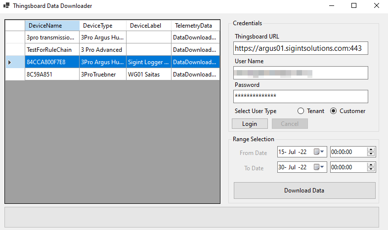

# 3pro-Data-Downloader

To reduce the potential for abuse the source code for that particular tool is not provided, as it can be used to perform DoS attacks to thingsboard installations. 

The downloader application can be found on the following repository [3pro Data Downloader](https://github.com/sigintsolutions/3Pro-Data-Downloader)

To download data run the thingsboard Data Downloader and input the necessary credentials. 

After logging in, a list of the available devices will be available.

Select one or more devices, and select the time range. 

Press the download data, 

*Warning*: The download process can take up to 30 minutes to complete for devices with a lot of data and extended time ranges. (ie 2 years of data)

Requires .Net Core to run. 